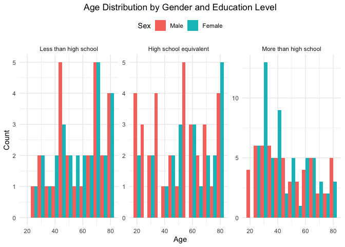
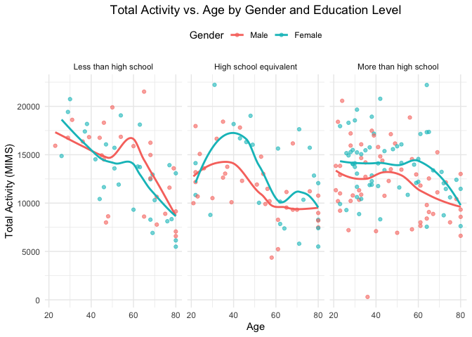
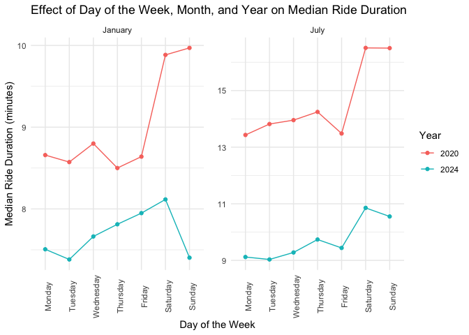
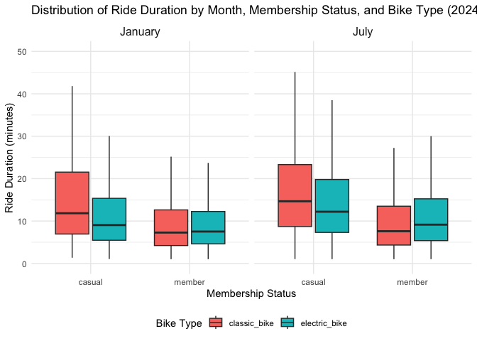

p8105_hw3_rw3033
================

# Question 1

``` r
library(p8105.datasets)
data("ny_noaa")
```

``` r
library(dplyr)
```

    ## 
    ## Attaching package: 'dplyr'

    ## The following objects are masked from 'package:stats':
    ## 
    ##     filter, lag

    ## The following objects are masked from 'package:base':
    ## 
    ##     intersect, setdiff, setequal, union

``` r
library(lubridate)
```

    ## 
    ## Attaching package: 'lubridate'

    ## The following objects are masked from 'package:base':
    ## 
    ##     date, intersect, setdiff, union

``` r
# Create separate variables for year, month, and day
ny_noaa = ny_noaa |>
  mutate(
    year = year(date),
    month = month(date),
    day = day(date)
  )

# Find the most commonly observed snowfall values
common_snow_values = ny_noaa |>
  group_by(snow) |>
  summarize(count = n()) |>
  arrange(desc(count))

# Display the most common snowfall values
print(ny_noaa)
```

    ## # A tibble: 2,595,176 × 10
    ##    id          date        prcp  snow  snwd tmax  tmin   year month   day
    ##    <chr>       <date>     <int> <int> <int> <chr> <chr> <dbl> <dbl> <int>
    ##  1 US1NYAB0001 2007-11-01    NA    NA    NA <NA>  <NA>   2007    11     1
    ##  2 US1NYAB0001 2007-11-02    NA    NA    NA <NA>  <NA>   2007    11     2
    ##  3 US1NYAB0001 2007-11-03    NA    NA    NA <NA>  <NA>   2007    11     3
    ##  4 US1NYAB0001 2007-11-04    NA    NA    NA <NA>  <NA>   2007    11     4
    ##  5 US1NYAB0001 2007-11-05    NA    NA    NA <NA>  <NA>   2007    11     5
    ##  6 US1NYAB0001 2007-11-06    NA    NA    NA <NA>  <NA>   2007    11     6
    ##  7 US1NYAB0001 2007-11-07    NA    NA    NA <NA>  <NA>   2007    11     7
    ##  8 US1NYAB0001 2007-11-08    NA    NA    NA <NA>  <NA>   2007    11     8
    ##  9 US1NYAB0001 2007-11-09    NA    NA    NA <NA>  <NA>   2007    11     9
    ## 10 US1NYAB0001 2007-11-10    NA    NA    NA <NA>  <NA>   2007    11    10
    ## # ℹ 2,595,166 more rows

``` r
print(common_snow_values)
```

    ## # A tibble: 282 × 2
    ##     snow   count
    ##    <int>   <int>
    ##  1     0 2008508
    ##  2    NA  381221
    ##  3    25   31022
    ##  4    13   23095
    ##  5    51   18274
    ##  6    76   10173
    ##  7     8    9962
    ##  8     5    9748
    ##  9    38    9197
    ## 10     3    8790
    ## # ℹ 272 more rows

The most commonly observed value is 0 with 2008508 counts.

Since data for tmax and tmin are all ‘NA’ value, i cannt solve the
following questions: Make a two-panel plot showing the average max
temperature in January and in July in each station across years. Is
there any observable / interpretable structure? Any outliers? Make a
two-panel plot showing (i) tmax vs tmin for the full dataset (note that
a scatterplot may not be the best option); and (ii) make a plot showing
the distribution of snowfall values greater than 0 and less than 100
separately by year.

# Question 2

``` r
library(readr)

# Import Data
accel_df = read_csv("~/Desktop/BIST8105/HW/p8105_hw3_rw3033/nhanes_accel.csv",
  na = c("NA", ".", ""))|>
  janitor::clean_names()
```

    ## Rows: 250 Columns: 1441
    ## ── Column specification ────────────────────────────────────────────────────────
    ## Delimiter: ","
    ## dbl (1441): SEQN, min1, min2, min3, min4, min5, min6, min7, min8, min9, min1...
    ## 
    ## ℹ Use `spec()` to retrieve the full column specification for this data.
    ## ℹ Specify the column types or set `show_col_types = FALSE` to quiet this message.

``` r
covar_df = read_csv("~/Desktop/BIST8105/HW/p8105_hw3_rw3033/nhanes_covar.csv",
  skip = 4,
  na = c("NA", ".", ""))|>
  janitor::clean_names()
```

    ## Rows: 250 Columns: 5
    ## ── Column specification ────────────────────────────────────────────────────────
    ## Delimiter: ","
    ## dbl (5): SEQN, sex, age, BMI, education
    ## 
    ## ℹ Use `spec()` to retrieve the full column specification for this data.
    ## ℹ Specify the column types or set `show_col_types = FALSE` to quiet this message.

``` r
# Data cleaning
library(dplyr)

# Exclude participants less than 21 years of age, and those with missing demographic data
clean_covar_df = covar_df |>
  filter(age >= 21) |>   
  na.omit()    

# Encode the variables
clean_covar_df = clean_covar_df |>
  mutate(
    sex = factor(sex, levels = c(1, 2), labels = c("Male", "Female")),
    education = factor(education, 
                       levels = c(1, 2, 3), 
                       labels = c("Less than high school", 
                                  "High school equivalent", 
                                  "More than high school"),
                       ordered = TRUE))

# Merge
merged_df = left_join(clean_covar_df, accel_df, by = c("seqn"))
```

``` r
library(dplyr)
library(tidyr)  
library(knitr)
library(ggplot2) 


# Produce a reader-friendly table for the number of men and women in each education category
education_gender_table = merged_df |>
  group_by(education, sex) |>              
  summarise(count = n()) |>               
  pivot_wider(names_from = sex, values_from = count)|>
  rename("Education Level" = education,
         "Number of Males" = Male, 
         "Number of Females" = Female)
```

    ## `summarise()` has grouped output by 'education'. You can override using the
    ## `.groups` argument.

``` r
kable(education_gender_table, 
      caption = "Number of Men and Women in Each Education Category",
      col.names = c("Education Level", "Number of Males", "Number of Females"))
```

| Education Level        | Number of Males | Number of Females |
|:-----------------------|----------------:|------------------:|
| Less than high school  |              27 |                28 |
| High school equivalent |              35 |                23 |
| More than high school  |              56 |                59 |

Number of Men and Women in Each Education Category

``` r
# Create a visualization of the age distributions for men and women in each education category
ggplot(merged_df, aes(x = age, fill = sex)) +
  geom_histogram(binwidth = 5, position = "dodge",) +
  facet_wrap(~ education, scales = "free_y") +
  labs(title = "Age Distribution by Gender and Education Level",
       x = "Age",
       y = "Count",
       fill = "Sex") +
  theme_minimal() +
  theme(
    legend.position = "top",
    plot.title = element_text(hjust = 0.5)
  )
```

<!-- -->
Comment: Gender Disparities: The table and plot highlight notable gender
disparities within the “High school equivalent” group. There are
significantly more males (35) than females (23), suggesting that men are
more represented in this education level. In contrast, the other
categories (“Less than high school” and “More than high school”) have a
relatively balanced gender distribution.

Age Disparities: Age distribution also varies considerably across
education levels. In the “More than high school” category, participants
are predominantly in the 30-50 age range, indicating a younger cohort.
Meanwhile, the “Less than high school” group has more participants in
the older age ranges (60+), suggesting that lower educational attainment
may be more common in older generations.

Intersectional Disparities: Combining gender and age, disparities become
more pronounced. For example, women in the “More than high school”
category appear to have a wider age spread, while men are more
concentrated in younger age groups. In contrast, the “High school
equivalent” category shows fewer women in the 40-50 range compared to
men, highlighting potential differences in educational attainment by
gender and age.

``` r
# Aggregate total activity for each participant
total_activity_df = merged_df |>
  mutate(total_act = rowSums(across(min1:min1440)))

# Create the plot
ggplot(total_activity_df, aes(x = age, y = total_act, color = sex)) +
  geom_point(alpha = 0.6) + 
  geom_smooth(se = FALSE) +
  facet_grid(.~ education) +
  labs(title = "Total Activity vs. Age by Gender and Education Level",
       x = "Age",
       y = "Total Activity (MIMS)",
       color = "Gender") +
  theme_minimal() +
  theme(
    legend.position = "top",
    plot.title = element_text(hjust = 0.5)
  )
```

    ## `geom_smooth()` using method = 'loess' and formula = 'y ~ x'

<!-- -->

Comments: Gender Differences: The trend lines indicate a general
decrease in activity with age for both men and women, but the rate of
decline varies by gender and education level. In the “Less than high
school” and “High school equivalent” groups, men show a steeper decline
compared to women. In contrast, for the “More than high school”
category, men and women have a similar, more gradual decline in
activity.

Education-Level Disparities: The “More than high school” group has a
wider spread of total activity values, with a few high outliers,
suggesting that individuals with more education tend to engage in a
broader range of physical activities. The “High school equivalent” and
“Less than high school” groups show lower overall activity levels, with
most points clustered near zero, indicating lower physical activity for
these participants.

Age and Activity Trends: Across all categories, younger participants
tend to have higher total activity levels, while older participants show
lower levels. The negative slopes of the trend lines in all panels
confirm that age is inversely associated with physical activity, and
this effect is seen in all education groups.

``` r
# Reform the merged_df to long_merged_df to have each minute name
long_merged_df <- merged_df |>
  select(seqn, sex, education, starts_with("min")) |>
  pivot_longer(
    cols = starts_with("min"),          
    names_to = "minute",                 
    values_to = "activity"             
  ) |>
  mutate(minute = as.numeric(gsub("min", "", minute)))  

# Create a three-panel plot by education level
ggplot(long_merged_df, aes(x = minute, y = activity, group = seqn, color = sex)) +
  geom_line(alpha = 0.1) + 
  geom_smooth(aes(group = sex), se = FALSE) + 
  facet_grid(.~ education) + 
  labs(title = "24-Hour Activity Time Course by Education Level and Gender",
       x = "Minute of the Day",
       y = "Activity Level (MIMS)",
       color = "Gender") +
  theme_minimal() +
  theme(
    legend.position = "top",
    plot.title = element_text(hjust = 0.5)
  )
```

    ## `geom_smooth()` using method = 'gam' and formula = 'y ~ s(x, bs = "cs")'

<!-- -->
Comments: Activity Peaks: All three education levels show a clear peak
in activity during the morning hours (around 500-600 minutes,
corresponding to 8-10 AM) and a second, smaller peak in the afternoon
(around 1,000-1,100 minutes, corresponding to 4-6 PM). This suggests
that participants are generally more active in the morning and late
afternoon, likely corresponding to daily routines like commuting,
exercise, or household chores.

Gender Differences: The trend lines for men (red) and women (blue) are
closely aligned in all three education levels, indicating minimal
differences in overall activity patterns between genders. This suggests
that gender does not significantly affect daily activity patterns within
each education level.

Education-Level Variations: Participants with a “More than high school”
education level tend to have lower activity levels on average,
especially in the early morning and late evening. This is indicated by
the lower peaks and flatter trend line compared to the “Less than high
school” and “High school equivalent” groups. Conversely, participants in
the “Less than high school” category show higher overall activity,
especially during peak periods.

Conclusions: The graph indicates that education level may influence
overall activity levels and daily routines, but gender has little effect
on the time course of physical activity. People with less education tend
to be more active during the day, while those with higher education
levels show relatively lower activity patterns throughout the day. This
could be related to occupational differences or lifestyle factors
associated with varying levels of educational attainment.

# Question 3

``` r
library(readr)

# Import Data
Jan2020_df = read_csv("~/Desktop/BIST8105/HW/p8105_hw3_rw3033/Jan 2020 Citi.csv",
  na = c("NA", ".", ""))|>
  janitor::clean_names()
```

    ## Rows: 12420 Columns: 7
    ## ── Column specification ────────────────────────────────────────────────────────
    ## Delimiter: ","
    ## chr (6): ride_id, rideable_type, weekdays, start_station_name, end_station_n...
    ## dbl (1): duration
    ## 
    ## ℹ Use `spec()` to retrieve the full column specification for this data.
    ## ℹ Specify the column types or set `show_col_types = FALSE` to quiet this message.

``` r
July2020_df = read_csv("~/Desktop/BIST8105/HW/p8105_hw3_rw3033/July 2020 Citi.csv",
  na = c("NA", ".", ""))|>
  janitor::clean_names()
```

    ## Rows: 21048 Columns: 7
    ## ── Column specification ────────────────────────────────────────────────────────
    ## Delimiter: ","
    ## chr (6): ride_id, rideable_type, weekdays, start_station_name, end_station_n...
    ## dbl (1): duration
    ## 
    ## ℹ Use `spec()` to retrieve the full column specification for this data.
    ## ℹ Specify the column types or set `show_col_types = FALSE` to quiet this message.

``` r
Jan2024_df = read_csv("~/Desktop/BIST8105/HW/p8105_hw3_rw3033/Jan 2024 Citi.csv",
  na = c("NA", ".", ""))|>
  janitor::clean_names()
```

    ## Rows: 18861 Columns: 7
    ## ── Column specification ────────────────────────────────────────────────────────
    ## Delimiter: ","
    ## chr (6): ride_id, rideable_type, weekdays, start_station_name, end_station_n...
    ## dbl (1): duration
    ## 
    ## ℹ Use `spec()` to retrieve the full column specification for this data.
    ## ℹ Specify the column types or set `show_col_types = FALSE` to quiet this message.

``` r
July2024_df = read_csv("~/Desktop/BIST8105/HW/p8105_hw3_rw3033/July 2024 Citi.csv",
  na = c("NA", ".", ""))|>
  janitor::clean_names()
```

    ## Rows: 47156 Columns: 7
    ## ── Column specification ────────────────────────────────────────────────────────
    ## Delimiter: ","
    ## chr (6): ride_id, rideable_type, weekdays, start_station_name, end_station_n...
    ## dbl (1): duration
    ## 
    ## ℹ Use `spec()` to retrieve the full column specification for this data.
    ## ℹ Specify the column types or set `show_col_types = FALSE` to quiet this message.

The dataset comprises information from the NYC Citi Bike system,
covering four different months: January 2020, July 2020, January 2024,
and July 2024. Each dataset reflects a subset of the bike ride data,
containing approximately 1% of all rides with durations of less than
four hours for each respective month. The resulting
dataframes—Jan2020_df, July2020_df, Jan2024_df, and July2024_df—provide
a detailed view of individual bike rides, capturing key attributes such
as the type of bike, the start and end stations, and rider
characteristics.

Each dataframe consists of 7 variables and varies in the number of rows.
The columns are consistent across the four dataframes and include a
combination of categorical and numeric variables. The variables present
are: ride_id (a unique identifier for each ride), rideable_type
(indicating whether the bike is a pedal-powered or electric bike),
weekdays (the day of the week the ride occurred), start_station_name
(the name of the starting station), end_station_name (the name of the
destination station), duration (the length of the ride in minutes), and
member_casual (indicating whether the rider is a member of the Citi Bike
program or a casual user).

``` r
# Load necessary libraries
library(dplyr)
library(janitor)
```

    ## 
    ## Attaching package: 'janitor'

    ## The following objects are masked from 'package:stats':
    ## 
    ##     chisq.test, fisher.test

``` r
library(flextable)

# Adding year and month to each dataset
Jan2020_df=Jan2020_df|>mutate(year = "2020", month = "January")
July2020_df=July2020_df|>mutate(year = "2020", month = "July")
Jan2024_df=Jan2024_df|>mutate(year = "2024", month = "January")
July2024_df=July2024_df|>mutate(year = "2024", month = "July")

# Combine all the datasets
combined_df = bind_rows(Jan2020_df, July2020_df, Jan2024_df, July2024_df)

# Group by year, month, and rider type, then summarize the total number of rides
combined_table=combined_df|>
  group_by(year, month, member_casual) |>
  summarize(total_rides = n(), .groups = 'drop')

# Produce a reader-friendly table showing the total number of rides in each combination of year and month separating casual riders and Citi Bike members.

# Create an 2 by 4 table
combined_table = combined_table |>
  pivot_wider(names_from = c(month, member_casual), 
              values_from = total_rides,
              names_sep = "_")

combined_table = flextable(combined_table) |>
  add_header_row(values = c(" ", "January", "July"), colwidths = c(1, 2, 2)) |>
  set_header_labels(`January_member` = "Member", `January_casual` = "Casual", 
                    `July_member` = "Member", `July_casual` = "Casual") |>
  theme_vanilla() |>
  align(align = "center", part = "header")

# Print the formatted flextable
combined_table
```


Comment: The table reveals a clear increase in the total number of rides
for both `Casual` and `Member` riders between 2020 and 2024 for the
months of January and July. This trend indicates growing popularity and
usage of the Citi Bike system over time.

For January, casual rides rose from 984 in 2020 to 2,108 in 2024, while
member rides increased from 11,436 to 16,753. This growth suggests that
winter ridership is becoming more popular, possibly due to improved
biking infrastructure or changing user preferences during the colder
months.

In July, the increase is more pronounced. Casual rides jumped from 5,637
in 2020 to 10,894 in 2024, and member rides surged from 15,411 to
36,262. This substantial growth in summer months indicates that July
remains a peak season for biking, with members and casual riders
significantly boosting their usage.

Members consistently recorded higher ride numbers compared to casual
riders, suggesting they are more frequent users of the system. The sharp
rise in member ridership, especially in July, could point to an
expanding user base that relies on Citi Bike for daily commuting.

Overall, the data indicates a positive trajectory for Citi Bike, with
both casual and member ridership increasing significantly, particularly
during the summer months.

``` r
# Make a table showing the 5 most popular starting stations for July 2024; include the number of rides originating from these stations.
top_stations = July2024_df |>
  group_by(start_station_name) |>
  summarize(num_rides = n()) |> 
  arrange(desc(num_rides)) |>   
  slice_head(n = 5)                  

print(top_stations)
```

    ## # A tibble: 5 × 2
    ##   start_station_name       num_rides
    ##   <chr>                        <int>
    ## 1 Pier 61 at Chelsea Piers       163
    ## 2 University Pl & E 14 St        155
    ## 3 W 21 St & 6 Ave                152
    ## 4 West St & Chambers St          150
    ## 5 W 31 St & 7 Ave                146

``` r
library(ggplot2)

# Make a plot to investigate the effects of day of the week, month, and year on median ride duration. 

# Create a dataframe with median ride durations
median_duration_df = combined_df |>
  group_by(year, month, weekdays) |>
  summarize(median_duration = median(duration, na.rm = TRUE), .groups = 'drop')|>
  mutate(weekdays = factor(weekdays, levels = c("Monday", "Tuesday", "Wednesday", "Thursday", "Friday", "Saturday", "Sunday")))

# Create the plot using ggplot
ggplot(median_duration_df, aes(x = weekdays, y = median_duration, color = as.factor(year), group = year)) +
  geom_line() +
  geom_point() +
  facet_wrap(~ month, scales = "free_y") +
  labs(
    title = "Effect of Day of the Week, Month, and Year on Median Ride Duration",
    x = "Day of the Week",
    y = "Median Ride Duration (minutes)",
    color = "Year"
  ) +
  theme_minimal() +
  theme(
    axis.text.x = element_text(angle = 90),
    panel.spacing = unit(1, "lines")
  )
```

<!-- -->
Comment: Comparing the two years, 2020 has noticeably higher median
durations than 2024, especially in July, which could indicate shifts in
rider behavior or external factors influencing ride times over the
years.

``` r
# Create a dataframe with only data from 2024
df_2024 = combined_df |> filter(year == 2024)

# Create a boxplot to show the distribution of ride duration by month, membership status, and bike type
ggplot(df_2024, aes(x = member_casual, y = duration, fill = rideable_type)) +
  geom_boxplot(outlier.shape = NA) +
  facet_wrap(~ month) +
    scale_y_continuous(limits = c(0, 50)) + 
  labs(
    title = "Distribution of Ride Duration by Month, Membership Status, and Bike Type (2024)",
    x = "Membership Status",
    y = "Ride Duration (minutes)",
    fill = "Bike Type"
  ) +
  theme_minimal() +
  theme(
    strip.text = element_text(size = 12),
      scale_y_continuous(limits = c(0, 60)), 
    legend.position = "bottom"
  )
```

    ## Warning: Removed 1199 rows containing non-finite outside the scale range
    ## (`stat_boxplot()`).

<!-- -->

Comment: The boxplot shows that casual riders generally have longer ride
durations than members in both January and July. Additionally, classic
bikes are associated with longer ride durations compared to electric
bikes for casual riders, likely due to the higher speed and efficiency
of electric bikes. The difference is particularly pronounced in July,
where casual riders using classic bikes have a much wider range of ride
durations, suggesting that summer encourages more varied and potentially
recreational rides. For members, ride durations are relatively
consistent across bike types and months, indicating more predictable use
patterns, possibly for commuting.
